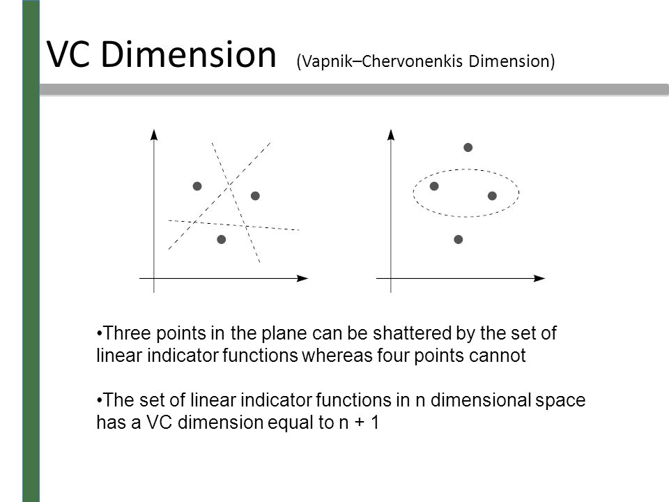

# Machine Learning
## Notes on machine learning and linear algebra

This site is for mostly my personal notes  for storing interesting documents and links related to machine learning. Please feel free to contribute to this site.

### Data Sources

[Here is the link](data-sources.md)

### Glossary of machine learning terms

[Machine Learning Glossary](https://developers.google.com/machine-learning/glossary/)
[10 Machine Learning terms explained](http://blog.aylien.com/10-machine-learning-terms-explained-in-simple/)

Some of the terms I found useful to take note of
* Algorithms: Naive Bayes, Decission Tree, SVM (Support Vector Machine), Neural Networks
* Classifier
* Regression
* Supervised learning - 
* Accuracy - percent of correct predictions from all the input
    * Precission - percent of prediction of a category that was correct, i.e. how useful is the result. For example, of all the cats predicted what percent was correct
    * Recall - percent of of a category was correctly predicted, i.e. how complete was result. For example, of all the cats in the data which percent was correct predicted * Blog by Christopher Olah
## Neural Network Architectures

* [CNN](cnn/ref.md) - Convolutional Neural Network
* [RNN](rnn/ref.md) - Recurrent Neural Network  
* [LSTM](https://colah.github.io/posts/2015-08-Understanding-LSTMs/) - Long Short Term Memory

#### Loss function
Machine learning making a prediction from the input. The difference between the _true value_ and the prediction is called the loss. Since there are may ways to define the distance between the  prediction and the truth, so there are may ways to define the loss, and this is refered to as the loss function.

* MSE - mean square error
* KL divergence, a metric on the difference between 2 probability distributions.

[Some loss function discussion](https://heartbeat.fritz.ai/5-regression-loss-functions-all-machine-learners-should-know-4fb140e9d4b0)

### Gradient Descent

* SGD - stocastic gradinet descent [deep dive here](https://gluon.mxnet.io/chapter06_optimization/gd-sgd-scratch.html)
* [ADAM](https://towardsdatascience.com/adam-latest-trends-in-deep-learning-optimization-6be9a291375c) - efficient gradient descent optimizer, [javascript implementation here](adam_optimizer.md)
* Blog by [Christopher Olah](https://colah.github.io/)
## Interesting Articles

* [Attention](https://jalammar.github.io/illustrated-transformer/)

## ROC

* Receiver operating characteristic

### Free Energy Principle

* What is it
* How do we use it
* What is the mathematical formulation
* Bayesian models 

### Capsule Network
* Hinton et al

* Why is it interesting?
* Key ideas in convolutional networks
* Alternative to max pooling
* Preserving key invariance

[capsule network writeup](https://medium.com/ai%C2%B3-theory-practice-business/understanding-hintons-capsule-networks-part-i-intuition-b4b559d1159b)

### instll tensoeflow on windows

[Jeff Heaton](https://www.youtube.com/watch?v=59duINoc8GM)

[Glossary](https://developers.google.com/machine-learning/glossary/)

* [Arxiv Sanity Preserver](http://www.arxiv-sanity.com/)
* [Vapnik-Chervonenkis Dimension](https://towardsdatascience.com/measuring-the-power-of-a-classifier-c765a7446c1c) [video](https://www.youtube.com/watch?v=KI9PvB9wwrU) - shortened to VC Dimensions, measures the complexity of a machine learning model.

