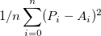

## Bias & Variance

### Bias

How far from the true relationship is called the Bias. Often computed as the 

* Ai - actual value for i
* Pi - predicted value for i

## Variance

Is how well the model fits a testing set

