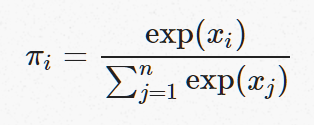
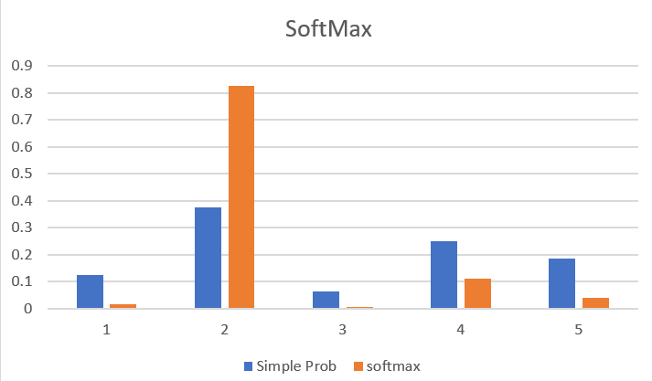

### Softmax

Observation x is a vector of logits and most of the values are greater than 1 then softmax gives a kind of pseudo probablilty that give a high probability to the largest value. It works very badly if all the values of x are less than 1.

### let x = \[2, 6, 1, 4, 3]

#### Simple Probi = xi / sum(x)

#### &nbsp;softmax(__x__) = \[&pi;1, &pi;2, ... &pi;n\] 

where 

### Exp-normalize trick

The exp function overflows very easily even for relatively small integers
Noting that exp(a+b)  = exp(a)exp(b)  

SoftMax(__x__)  = exp(xi) / &sum; exp(__x__)

SoftMax(__x__) = exp(xi-b)*exp(b) / &sum;(exp(__x__-b)*exp(b)) 
&nbsp;&nbsp;&nbsp;&nbsp;&nbsp;= exp(xi-b) / &sum;(exp(x-b))  &nbsp;&nbsp;&nbsp;where b is max __x__
           
 &nbsp;&nbsp;&nbsp;&nbsp;&nbsp;log &pi;i = xi − logsumexp(__x__) 
 &nbsp;&nbsp;&nbsp;&nbsp;&nbsp;logsumexp(__x__)=b+log &sum; exp(xi−b)

 
 Exp-normalize is the gradient of log-sum-exp.

Γ Δ Θ Λ Ξ Π Σ Φ Ψ Ω
α β γ δ ε ζ η θ ι κ λ μ
ν ξ π ρ ς σ τ υ φ χ ψ ω
ϐ ϑ ϒ ϕ ϖ Ϛ Ϟ Ϡ ϰ ϱ ϲ
